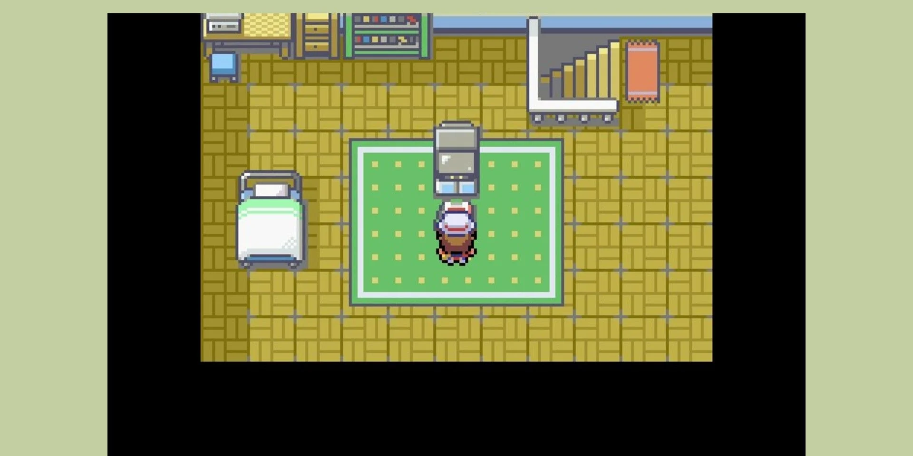
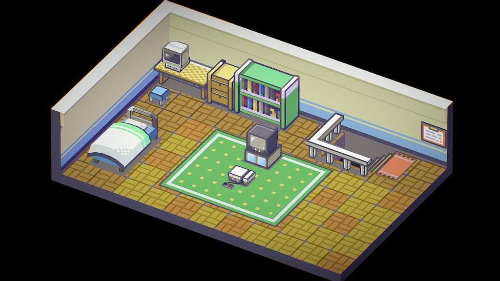

# Red's room escena 3D
## Proyecto Final de Gráficas Computacionales

### Desarrolladores:
####  - Brandon Ivan Candela Leal
####  - Sofia Pamela Recinos Dorst
####  - Antonio Torres Carvjal

### Descripción
#### En este proyecto se busca programar la representación 3D de la habitación de Red del videojuego Pokemon Red and Blue en una escena 3D interactiva. La cual, se conformará de figuras compuestas con texturas, colores sólidos, iluminación y sombras añadidas.
#### En esta escena se podrá apreciar:
####  - Tres paredes de la habitación
####  - Una cama
####  - Un escritorio con una computadora
####  - Una televisión con una consola
####  - Un banco (mueble
####  - Un librero lleno
####  - Unas escaleras de bajada

### Ejemplo 1

### Ejemplo 2
 
